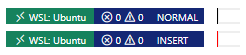

# Modex

## Description
Modex is an unpublished VSCode extension that partially implemented some of my favourite navigation keybindings of 2020, before I moved over to Vim.

## Functionality
Capslock toggles between two familiar modes: normal and insert. Insert mode leaves VSCode's default keybindings unchanged. Normal mode maps navigation keys to the right hand of the home row, and editing shortcuts to the left. The active mode is displayed on the status bar and indicated using an alteration to the caret:

Since capslock is used to toggle modes by default, system capslock state is altered during use. This was fine for me at the time, as I only ever held shift to capitalise.

## Normal mode keybindings
| Key      | Action       |
|----------|--------------|
| Capslock | Switch mode  |
| i        | Up           |
| j        | Left         |
| k        | Down         |
| l        | Right        |
| u        | Home         |
| o        | End          |
| n        | PageUp       |
| m        | PageDown     |
| ;        | Backspace    |
| p        | Delete       |
| c        | Copy         |
| x        | Cut          |
| v        | Paste        |
| e        | Undo         |
| r        | Redo         |

## Issues
This project was aimed at replacing an AutoHotKey script I wrote to remap keydown events on Windows. At the time, the VSCode extension API didn't give access to keydown events, which was necessary to get modifier-key shortcuts that involve keys targeted by Modex to work correctly without manually mapping them all to appropriate VSCode commands, such as **Ctrl+j** to **cursorWordLeft**. This meant Modex keybindings were limited to unmodified keys only.

The solution to this issue (and others) turned out to be remarkably simple: just use Vim.
